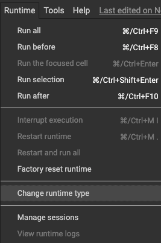
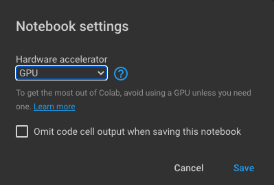
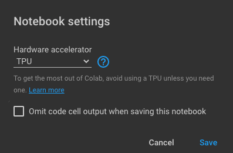
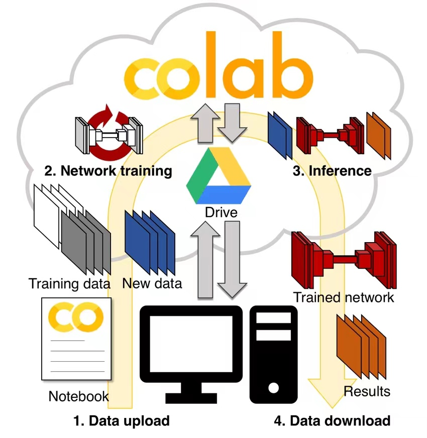

## About The Project

This is the Group Project for IDS 706 Fall 2021, group members include Chang Xu and Yongxin Tan. 

As a subset of Artificial Intelligence (AI), machine learning (ML) is the area of computational science that focuses on analyzing and interpreting patterns and structures in data to enable learning, reasoning, and decision making outside of human interaction. After writing a machine learning model, a user can feed the algorithm countless data that none human is able to process, so that the algorithm will makr data-driven recommendataions and decisions. 

Although machine learning algorithm usually requires tremendous computing power, cloud computing provides nearly unlimite computing resources so that nearly everyone can train a ML model for free. The main goal of this project is to show you both the code and a step-by-step tutorial to train a model on Google Cloud Platform (GCP). You can find all necessary code under the `/src` folder, and this document will focus more on the tutorial part.

In this document, we will provide the following contents:
* Basic matrix operations
* Basic data structures for PyTorch
* How to write a linear regression model
* How to train a model using Google Colab
* Resource links for each topic

## Getting Started

### Local Installation

If you want to play with the code locally, Python is the only thing you need. 

1. Start by installing Homebrew:
    ```shell
    /bin/bash -c "$(curl -fsSL https://raw.githubusercontent.com/Homebrew/install/HEAD/install.sh)"
    ```
2. Install Pyenv using Homebrew to manage your Python version:
    ```shell
    brew install pyenv
    ```
3. Install Python using Pyenv, we recommend using Python 3.9:
    ```shell
    pyenv install 3.9.2 
    ```
4. To test that you have successfully installed Python, run the following code and you should get your version number:
    ```shell
    python3 --version
    ```

For troubleshooting and more info, please refer to the following link: (https://docs.python.org/3/using/mac.html)

### Colab Getting Started

To get started with Google Colab, please refer to the following video

https://www.youtube.com/watch?v=inN8seMm7UI

## Matrix Basics

* If you want to learn martices from a math perspective, Khan Academy has a wonderful tutorial where you can find here: (https://www.khanacademy.org/math/precalculus/x9e81a4f98389efdf:matrices/x9e81a4f98389efdf:mat-intro/a/intro-to-matrices)

* If you want to learn how to creata a matrix in Python and play with it, you can find example code in `/src/matrices.py`

## PyTorch Basics

* PyTorch is a Python package that provides two high-level features:

    1. Tensor computation (like NumPy) with strong GPU acceleration
    2. Deep neural networks built on a tape-based autograd system

* Full document about PyTorch can be found here: https://pypi.org/project/torch/

* Example code about Torch can be found in `/src/torch_operations.py` and `/src/np_torch_bridge.py`

## Write code for a Linear Regression Model

Linear regression is a basic and commonly used type of predictive analysis. These regression estimates are used to explain the relationship between one dependent variable and one or more independent variables. The aim of Linear Regression is to minimize the distance between the points and the line y=αx+β. 

* α is the coefficients and β is the bias/intercept.

To write code for a Linear Regression Model, you can perform the following steps:

1. Build Dataset
    ```python
    def _build_dataset():
        x_values = [i for i in range(11)]
        x_train = np.array(x_values, dtype=np.float32)
        x_train = x_train.reshape(-1, 1)
    
        y_values = [2*i + 1 for i in x_values]
        y_train = np.array(y_values, dtype=np.float32).reshape(-1, 1)
        return x_train, y_train
    ```
2. Create Model Class
    ```python
    class LinearRegressionModel(nn.Module):
        def __init__(self, input_dim, output_dim):
            super(LinearRegressionModel, self).__init__()
            self.linear = nn.Linear(input_dim, output_dim)  
        
        def forward(self, x):
            out = self.linear(x)
            return out
    ```
3. Instantiate Model Class
    ```python
    model = LinearRegressionModel(input_dim, output_dim)
    ```
4. Instantiate Loss Class
    ```python
    criterion = nn.MSELoss()
    ```
5. Instantiate Optimizer Class
    ```python
    optimizer = torch.optim.SGD(model.parameters(), lr=learning_rate)
    ```
6. Train the Model
    ```python
    for epoch in range(epochs):
        epoch += 1
        inputs = torch.from_numpy(x_train).requires_grad_()
        labels = torch.from_numpy(y_train)
        optimizer.zero_grad() 
        outputs = model(inputs)
        loss = criterion(outputs, labels)
        loss.backward()
        optimizer.step()
        print('epoch {}, loss {}'.format(epoch, loss.item()))
    ```

More detailed code can be found in `/src/CPU_linear_regression.py`

## Train a model on Google Colab

[Google Colaboratory](https://colab.research.google.com/) is a free Jupyter notebook environment that runs on Google’s cloud servers, letting the user leverage backend hardware like GPUs and TPUs (Tensor Processing Unit). This lets you do everything you can in a Jupyter notebook hosted in your local machine, without requiring the installations and setup for hosting a notebook in your local machine.

### Create a .ipynb notebook in Google Colab

Open a browser of your choice and go to[ colab.research.google.com](http://colab.research.google.com/) and sign in using your Google account. Click on a new notebook to create a new runtime instance.

In the top left corner, you can change the name of the notebook from “Untitled.ipynb“ to the name of your choice by clicking on it.

The cell execution block is where you type your code. To execute the cell, press shift + enter. 

The variable declared in one cell can be used in other cells as a global variable. The environment automatically prints the value of the variable in the last line of the code block if stated explicitly.

### Install packages in Google Colab

You can use the code cell in Colab not only to run Python code but also to run shell commands. Just add a **!** before a command. The exclamation point tells the notebook cell to run the following command as a shell command.

Most general packages needed for deep learning come pre-installed. In some cases, you might need less popular libraries, or you might need to run code on a different version of a library. To do this, you’ll need to install packages manually.

Usually, you need to click on **RESTART RUNTIME** for the newly installed packages to be used.

### Download datasets

When you’re training a machine learning model on your local machine, you’re likely to have trouble with the storage and bandwidth costs that come with downloading and storing the dataset required for training a model. Deep learning datasets can be massive in size, ranging between 20 to 50 Gb. Downloading them is most challenging if you’re living in a region where getting high-speed internet isn’t possible.

The most efficient way to use datasets is to use a cloud interface to download them, rather than manually uploading the dataset from a local machine. Colab gives us a variety of ways to download the dataset from common data hosting platforms.

#### Download datasets from Kaggle

To download an existing dataset from Kaggle, we can follow the steps outlined below:

1. Go to your Kaggle Account and click on “Create New API Token”. This will download a kaggle.json file to your machine.

2. Go to your Google Colab project file, and run the following commands:

   ```python
   ! pip install -q kaggle
   from google.colab import files
   
   # choose the kaggle.json file that you downloaded
   files.upload()
   ! mkdir ~/.kaggle
   
   # make a directory named kaggle and copy the kaggle.json file there
   cp kaggle.json ~/.kaggle/
   
   # change the permissions of the file
   ! chmod 600 ~/.kaggle/kaggle.json
   
   # download the dataset for a specific competition
   ! kaggle competitions download -c 'name-of-competition'
   ```

#### Download datasets from any generic websites

Depending on the browser that you’re using, there are extensions available to convert the dataset download link into `curl` or `wget` format. You can use this to efficiently download the dataset.

1. For Firefox, there’s the cliget browser extension: [cliget – Get this Extension for 🦊 Firefox (en-US)](https://addons.mozilla.org/en-US/firefox/addon/cliget/)
2. For Chrome, there’s the CurlWget extension: [Ad Added CurlWget 52](https://chrome.google.com/webstore/detail/curlwget/dgcfkhmmpcmkikfmonjcalnjcmjcjjdn?hl=en)

These extensions will generate a curl/wget command as soon as you click on any download button in your browser. 

You can then copy that command and execute it in your Colab notebook to download the dataset.

For example, to download a file from some.url and save it as some.file, you can use the following command in Colab:

```shell
!curl http://some.url --output some.file
```

*NOTE: The curl command will download the dataset in the Colab workspace, which will be lost every time the runtime is disconnected. Hence a safe practice is to move the dataset into your cloud drive as soon as the dataset is downloaded completely.*

#### Download datasets from GCP or Google Drive

Google Cloud Platform is a cloud computing and storage platform. You can use it to store large datasets, and you can import that dataset directly from the cloud into Colab.

To upload and download files on GCP, first you need to authenticate your Google account.

```python
from google.colab import auth
auth.authenticate_user()
```

It will ask you to visit a link using your Google account, and give you an authentication key. Paste that key in the provided space to verify your account.

After that, install gsutil to upload and download files, and then init gcloud.

```python
!curl https://sdk.cloud.google.com | bash
!gcloud init
```

Now you can use the following commands to download/upload files to and from Google Cloud Storage.

To download a file from Cloud Storage to Google Colab, use:

```python
!gsutil cp gs://maskaravivek-data/data_file.csv 
```

To upload files from Google Colab to Cloud, use:

```python
gsutil cp test.csv gs://maskaravivek-data/
```

### Use GPU and TPU on Google Colab

Deep learning is a computationally expensive process, a lot of calculations need to be executed at the same time to train a model. To mitigate this issue, Google Colab offers us not only the classic CPU runtime but also an option for a GPU and TPU runtime as well.

The CPU runtime is best for training large models because of the high memory it provides. 

The GPU runtime shows better flexibility and programmability for irregular computations, such as small batches and nonMatMul computations.

The TPU runtime is highly-optimized for large batches and CNNs and has the highest training throughput.

If you have a smaller model to train, we suggest training the model on GPU/TPU runtime to use Colab to its full potential.

#### GPU

To utilize GPU on Google Colab in PyTorch, we need to firstly enable GPU by changing Colab's runtime type to GPU:





Differing from training model on CPU, we need to transfer our tensors and model from CPU to GPU as below:

```python
if torch.cuda.is_available():
	tensor_cpu.cuda()
```

```python
device = torch.device("cuda:0" if torch.cuda.is_available() else "cpu")
model.to(device)
```

It's also easy to transfer back to CPU by:

```python
tensor_cpu.cpu()
```

#### TPU

Similarly, we need to change runtime type in Colab by toggling TPU:



The PyTorch support for Cloud TPUs is achieved via integration with XLA (Accelerated Linear Algebra), a compiler for linear algebra that can target multiple types of hardware, including CPU, GPU, and TPU. XLA connects our model with the Google Cloud TPU in the distributed multiprocessing environment.

To verify whether the TPU environment is working properly, let's run the below line of codes:

```python
import os
assert os.environ['COLAB_TPU_ADDR']
```

It will be executed successfully if the TPU is enabled otherwise it will return the ‘KeyError: ‘COLAB_TPU_ADDR’’.

We can also check the TPU by printing its address:

```python
TPU_Path = 'grpc://'+os.environ['COLAB_TPU_ADDR']
print('TPU Address:', TPU_Path)
```

After enabling the TPU, we will install the compatible wheels and dependencies to setup the XLA environment using the below code:

```python
VERSION = "20200516" 
!curl https://raw.githubusercontent.com/pytorch/xla/master/contrib/scripts/env-setup.py -o pytorch-xla-env-setup.py
!python pytorch-xla-env-setup.py --version $VERSION
```

After it is installed successfully, we can define and train the model as shown in `/src/CNN_TPU_GCP.py`.

### Save and load models

Training model takes a lot of time, so it would be wise to be able to save the trained model to use again and again. Training it every time would be very frustrating and time-consuming. Google Colab allows you to save models and load them.



#### Save and load a model

You can save the entire model and export it to other machines and load it back later on.

To save an entire model, use:

```python
#make sure to make a saved_model directory if it doesn't exist
torch.save('saved_model/my_model')
```

To load a saved model, use:

```python
new_model = torch.load('saved_model/my_model')
```

